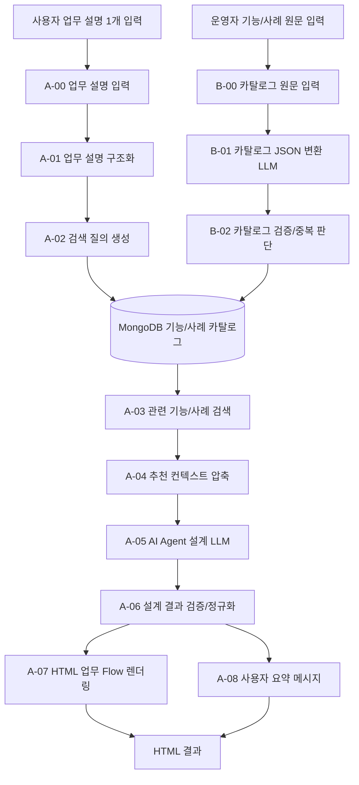

# 업무 AI 에이전트 설계 Flow 서비스형 재설계 상세 설계서

이 문서는 `business_agent_design_flow`를 실제 서비스 가능한 수준으로 다시 만든다고 가정했을 때의 상세 설계입니다.
현재 구현은 자연어 업무 설명 하나를 받아 업무 구조화, 기능 추천, Markdown 설계서, Mermaid 다이어그램을 생성하는 체험형 Flow입니다.
새 구조는 이 장점을 유지하면서, MongoDB 기반 기능/사례 카탈로그와 HTML 기반 현재/개선 업무 Flow 시각화를 추가하는 방향입니다.

## 1. 목표

사용자는 업무 설명 한 칸만 입력합니다.

Flow는 입력된 업무 설명을 바탕으로 아래 결과를 자동 생성합니다.

- 현재 업무 Flow: 사람이 실제로 하고 있는 업무 절차를 단계, 담당 주체, 데이터, 시스템, 승인 지점으로 정리
- 개선 후 업무 Flow: AI Agent를 붙였을 때 바뀌는 업무 절차를 HTML 기반 다이어그램으로 표시
- 개선 아이디어: 사용 가능한 Langflow 기능, 기존 기능flow, 기존 개선 사례를 참고해 여러 후보안으로 추천
- 구현 가이드: 초보 Langflow 개발자가 어떤 노드를 어떤 순서로 만들면 되는지 구체적으로 안내
- 리스크 통제: 자동 발송, 시스템 변경, 승인, 민감 정보 등 사람 검토가 필요한 지점을 명확히 표시

핵심 UX 원칙은 "사용자가 여러 입력칸을 채우지 않는다"입니다.
목적, 데이터, 시스템, 제약, 원하는 출력, 사내 기능 후보는 모두 하나의 업무 설명 문단 안에 적습니다.

## 2. 전체 구성

새 설계는 2개의 Flow로 나누는 것이 좋습니다.

| Flow | 사용자 | 목적 |
| --- | --- | --- |
| A. 업무 AI 에이전트 설계 Flow | 일반 사용자, 초보 Langflow 개발자 | 업무 설명을 받아 현재/개선 업무 Flow와 AI Agent 구현안을 생성 |
| B. 기능/개선 사례 카탈로그 등록 Flow | 운영자, 숙련 사용자 | 자연어로 적은 기능 목록/개선 사례를 구조화해 MongoDB에 저장 |

이렇게 나누는 이유는 실행 빈도와 책임이 다르기 때문입니다.
일반 사용자는 업무 설명만 넣어야 하고, 기능 카탈로그 관리는 운영자가 별도로 수행하는 것이 안전합니다.

## 3. 현재 구현 진단

현재 폴더의 주요 컴포넌트는 아래와 같습니다.

| 현재 컴포넌트 | 역할 | 재설계 시 방향 |
| --- | --- | --- |
| `00 업무 설명 입력` | 자연어 업무 설명 한 칸 입력 | 유지. 단일 입력 UX의 중심 |
| `01 업무 프로세스 구조화` | 업무 설명에서 단계, 데이터, 제약 추정 | LLM 기반 구조화와 검증을 추가 |
| `02 AI 에이전트 기능 카탈로그` | 내장 기능 목록과 사용자가 문장으로 적은 기능 후보를 합침 | MongoDB 검색 결과 기반으로 변경 |
| `03 AI 에이전트 설계 프롬프트 준비` | LLM 프롬프트 구성 | Prompt Template 또는 프롬프트 생성 컴포넌트로 유지 가능 |
| `04 AI 에이전트 설계 결과 정리` | LLM 응답 정규화 및 fallback 설계 | JSON Schema 검증과 근거 추적 강화 |
| `05 사용자용 설계서 출력` | Markdown 설계서 생성 | Markdown 요약 출력 유지 |
| `06 업무 Flow 다이어그램 출력` | Mermaid 다이어그램 출력 | HTML 기반 before/after 업무 Flow 렌더러로 확장 |

현재 구조의 좋은 점은 사용자가 한 칸만 입력한다는 점입니다.
부족한 점은 기능/사례 카탈로그가 코드 내부에 고정되어 있고, 다이어그램이 Mermaid 중심이라 서비스형 결과물로 보기에는 표현력이 제한된다는 점입니다.

## 4. 사용자 시나리오

### 4.1 일반 사용자

1. 사용자가 업무 설명을 한 문단 또는 여러 문단으로 입력합니다.
2. Flow가 업무 목적, 현재 절차, 데이터/시스템, 제약, 원하는 결과를 자동 추출합니다.
3. MongoDB에서 관련 기능과 개선 사례를 검색합니다.
4. LLM이 현재 업무 Flow와 개선 후 업무 Flow를 설계합니다.
5. HTML 결과물과 짧은 요약 메시지가 반환됩니다.

예시 입력:

```text
매일 아침 생산 실적과 불량 데이터를 엑셀로 내려받아 설비별로 이상 징후를 확인합니다.
불량률이 전일 대비 급증한 설비는 최근 작업 이력과 정비 이력을 같이 조회해서 원인 후보를 정리합니다.
결과는 아침 회의 전에 팀장에게 공유하고, 긴급 건은 담당자에게 메일 초안을 작성합니다.
메일은 자동 발송하지 말고 사람이 확인한 뒤 보내야 합니다.
```

### 4.2 카탈로그 운영자

1. 운영자가 사용 가능한 기능 목록 또는 기존 개선 사례를 자연어로 입력합니다.
2. LLM이 이를 표준 카탈로그 JSON으로 변환합니다.
3. 검증 컴포넌트가 필수 필드, 중복, 위험 작업 여부를 검사합니다.
4. MongoDB에 upsert 저장합니다.
5. 저장 결과와 누락/보완 필요 항목을 반환합니다.

## 5. 권장 시스템 아키텍처



## 6. Flow A: 업무 AI 에이전트 설계 Flow

### A-00. 업무 설명 입력

| 항목 | 내용 |
| --- | --- |
| 입력 | `업무 설명` 한 칸 |
| 출력 | `업무 요청` JSON |
| 구현 | 기존 `00 업무 설명 입력` 개선 |

출력 예시:

```json
{
  "request_id": "uuid",
  "raw_work_description": "...",
  "input_language": "ko",
  "created_at": "2026-07-05T12:00:00+09:00"
}
```

### A-01. 업무 설명 구조화

사용자의 자유 서술을 Flow가 이해할 수 있는 가벼운 구조로 변환합니다.
이 단계는 deterministic 추정만으로는 한계가 있으므로 LLM 또는 Structured Output 사용을 권장합니다.

출력 예시:

```json
{
  "business_profile": {
    "business_goal": "아침 회의 전 위험 설비 식별",
    "actors": ["생산 담당자", "품질 담당자", "팀장"],
    "current_steps": [
      {"step": 1, "actor": "담당자", "action": "생산 실적 엑셀 다운로드", "system": "Excel"},
      {"step": 2, "actor": "담당자", "action": "불량률 급증 설비 확인", "system": "Excel"}
    ],
    "data_sources": ["생산 실적 파일", "품질 불량 파일", "설비 이력 시스템"],
    "constraints": ["메일 자동 발송 금지", "긴급 건은 팀장 승인 필요"],
    "desired_outputs": ["위험 설비 요약", "원인 후보", "메일 초안"]
  }
}
```

검증 규칙:

- 업무 단계가 비어 있으면 원문 문장을 기반으로 최소 3단계 추정
- 시스템 변경, 메일 발송, 고객 공유, 승인 관련 문장은 반드시 `constraints`에도 포함
- 불확실한 데이터/시스템은 `unknowns`로 분리하고 확정처럼 쓰지 않음

### A-02. 카탈로그 검색 질의 생성

업무 구조화 결과를 MongoDB 검색에 적합한 질의로 변환합니다.

출력 예시:

```json
{
  "search_queries": [
    {
      "query": "반복 데이터 조회 이상 탐지 리포트 메일 초안 승인",
      "categories": ["data_retrieval", "analysis", "reporting", "human_review"],
      "risk_tags": ["approval_required", "external_message_draft"]
    }
  ],
  "top_k": 8
}
```

### A-03. MongoDB 기능/사례 검색

MongoDB에서 기능 목록과 개선 사례를 조회합니다.

권장 검색 방식:

- 1차: `category`, `tags`, `trigger_signals` 기반 필터
- 2차: MongoDB text index 또는 Atlas Vector Search 기반 유사도 검색
- 3차: 업무 목적과 제약 조건에 맞는지 rerank

MongoDB Atlas Vector Search를 쓸 수 있으면 기능/사례 설명을 embedding하여 의미 검색을 적용합니다.
로컬 MongoDB만 쓴다면 text index와 태그 기반 검색부터 시작합니다.

### A-04. 추천 컨텍스트 압축

LLM에 MongoDB 검색 결과 전체를 넣지 않습니다.
각 기능/사례를 아래 정도로 압축합니다.

```json
{
  "capability_id": "html_report_flow",
  "title": "HTML 리포트 생성 Flow",
  "why_relevant": "조회 결과를 회의 전 공유 가능한 대시보드로 보여줄 수 있음",
  "recommended_usage": "위험 설비 요약과 원인 후보를 HTML 리포트로 렌더링",
  "risk_note": "자동 공유 전에 사람이 확인하는 단계 필요"
}
```

#### 추천 근거 Trace Schema

서비스형 구현에서는 추천 결과만 저장하면 안 됩니다.
사용자가 "왜 이 기능이 추천됐는지"를 확인할 수 있어야 하고, 운영자는 잘못 추천된 항목을 추적할 수 있어야 합니다.
따라서 A-03 검색, A-04 압축, A-05 LLM 설계, A-06 검증 단계는 아래 trace를 유지합니다.

```json
{
  "recommendation_trace": {
    "trace_id": "uuid",
    "request_id": "uuid",
    "generated_at": "2026-07-05T12:00:00+09:00",
    "search_plan": {
      "queries": [
        {
          "query_id": "q1",
          "query_text": "반복 데이터 조회 이상 탐지 리포트 메일 초안 승인",
          "categories": ["data_retrieval", "analysis", "reporting", "human_review"],
          "risk_tags": ["approval_required", "external_message_draft"],
          "top_k": 8
        }
      ],
      "retrieval_mode": "tag_text_or_vector",
      "catalog_status_filter": "active"
    },
    "ranked_catalog_items": [
      {
        "catalog_id": "html_report_flow",
        "collection": "agent_capability_catalog",
        "source_type": "capability",
        "title_ko": "HTML 리포트 생성 Flow",
        "match_score": 0.87,
        "matched_fields": ["categories", "trigger_signals", "summary_ko"],
        "matched_terms": ["리포트", "대시보드", "그래프"],
        "why_retrieved": "사용자가 조회 결과를 회의 전 확인 가능한 형태로 보고 싶다고 설명함"
      }
    ],
    "selected_recommendations": [
      {
        "recommendation_id": "rec_1",
        "catalog_ids": ["html_report_flow", "reusable_data_flow", "human_review_gate"],
        "title": "조회-분석-리포트 자동화",
        "why_selected": [
          "업무 설명에 반복 데이터 조회와 회의 전 공유가 포함됨",
          "메일 자동 발송 금지 제약이 있어 human_review_gate가 필요함"
        ],
        "expected_benefits": ["반복 조회 시간 감소", "보고 형식 표준화"],
        "risk_controls": ["메일은 초안까지만 생성", "팀장 승인 후 후속 조치"],
        "confidence": "high"
      }
    ],
    "rejected_or_deferred_items": [
      {
        "catalog_id": "agent_with_tools",
        "reason": "초기 체험 단계에서는 단순 조회-리포트 Flow가 더 낮은 리스크로 구현 가능함"
      }
    ],
    "unverified_suggestions": [
      {
        "title": "사내 설비 이력 API 연동",
        "reason": "사용자가 존재한다고 언급했지만 MongoDB 카탈로그에는 아직 등록되지 않음",
        "required_action": "카탈로그 등록 Flow로 기능을 먼저 등록하거나 운영자가 검증"
      }
    ],
    "validation_flags": {
      "all_selected_items_found_in_catalog": true,
      "dangerous_actions_have_human_review": true,
      "user_constraints_covered": true
    }
  }
}
```

Trace 운영 규칙:

- 최종 추천에는 반드시 `catalog_ids` 또는 `unverified_suggestions` 중 하나가 있어야 합니다.
- MongoDB 검색 결과에 없는 기능은 확정 추천으로 표시하지 않고 `unverified_suggestions`로 분리합니다.
- `match_score`는 검색 방식에 따라 text score, vector score, rerank score 중 사용 가능한 값을 기록합니다.
- 추천에서 제외한 주요 후보는 `rejected_or_deferred_items`에 이유를 남깁니다.
- 사용자에게 보여주는 화면에는 전체 trace를 모두 노출하지 않아도 되지만, "추천 근거" 요약은 반드시 표시합니다.

### A-05. AI Agent 설계 LLM

LLM은 아래를 한 번에 결정합니다.

- 현재 업무 Flow
- 개선 후 업무 Flow
- 추천 아키텍처 후보 1개 이상
- 각 후보의 장단점
- 사용할 기능/기존 Flow/시스템
- 사람 검토가 필요한 지점
- Langflow 구현 순서
- HTML 시각화 계획

출력은 반드시 JSON이어야 합니다.

핵심 출력 스키마:

```json
{
  "summary": {
    "title": "설비 이상 징후 점검 AI Agent 설계",
    "one_line": "반복 조회와 위험 설비 선별을 자동화하고, 메일 발송은 초안까지만 처리합니다."
  },
  "as_is_flow": {
    "lanes": ["사람", "데이터/시스템", "판단/승인"],
    "steps": []
  },
  "to_be_options": [
    {
      "option_id": "option_a",
      "title": "조회-분석-리포트 자동화",
      "recommended_for": "빠른 체험과 안정적인 보고 자동화",
      "to_be_flow": {"steps": []},
      "capabilities": [],
      "implementation_steps": [],
      "risks": [],
      "human_review_points": []
    }
  ],
  "html_view_plan": {
    "layout": "before_after_swimlane",
    "sections": ["summary", "as_is", "to_be", "capability_mapping", "roadmap"]
  }
}
```

### A-06. 설계 결과 검증/정규화

LLM 결과를 그대로 렌더링하지 않고 검증합니다.

검증 항목:

- JSON 파싱 가능 여부
- `as_is_flow.steps`와 `to_be_options[].to_be_flow.steps` 존재 여부
- 사용자가 언급한 제약사항 반영 여부
- 추천 기능이 MongoDB 검색 결과 또는 내부 기본 기능에 존재하는지 여부
- 자동 실행 위험 작업에 human review가 붙었는지 여부
- HTML 렌더링에 필요한 필드가 있는지 여부

검증 실패 시:

- 누락 필드는 deterministic fallback으로 보강
- 위험 작업은 자동으로 `human_review_required=true`
- 최종 출력에 `주의/보완 필요` 섹션 추가

### A-07. HTML 업무 Flow 렌더링

Mermaid만 출력하지 않고, 독립 실행 가능한 HTML을 생성합니다.
HTML은 외부 CDN 없이 열려야 하며, 내부 CSS와 데이터 JSON을 포함합니다.

권장 화면 구성:

1. 상단 요약 영역
2. 현재 업무 Flow
3. 개선 후 업무 Flow 후보 탭
4. Before/After 비교
5. 추천 기능 매핑
6. 구현 순서와 난이도
7. 리스크/승인 지점
8. 추가로 필요한 정보

HTML 디자인 원칙:

- 현재 Flow와 개선 Flow는 좌우 비교 또는 상하 비교를 지원
- 업무 단계는 카드형 타임라인으로 표시
- 사람, 시스템, AI Agent, 승인 단계는 색상과 아이콘으로 구분
- 자동화 가능 단계와 사람 검토 단계는 명확히 분리
- 긴 텍스트는 카드 안에서 줄바꿈되고 레이아웃을 깨지 않음
- A4/PDF 저장을 고려해 과도한 애니메이션을 사용하지 않음

HTML 내부 데이터 구조 예시:

```json
{
  "diagram": {
    "mode": "before_after",
    "as_is": {"steps": []},
    "to_be": {"steps": []}
  },
  "style": {
    "theme": "enterprise_light",
    "accent": "#4f63f6"
  }
}
```

#### HTML Renderer 보안 정책

HTML 결과물은 사용자 입력, MongoDB 카탈로그 텍스트, LLM 생성 텍스트를 포함할 수 있습니다.
따라서 HTML renderer는 "LLM이 완성 HTML을 작성하는 방식"이 아니라, 검증된 JSON을 안전한 템플릿에 주입하는 방식이어야 합니다.

필수 보안 규칙:

- 모든 사용자 입력, LLM 응답, MongoDB 텍스트는 기본적으로 HTML escape 처리합니다.
- renderer는 허용된 컴포넌트 템플릿과 CSS class만 사용합니다.
- `<script>`, `<iframe>`, `<object>`, `<embed>`, `<link rel="preload">` 같은 실행/외부 로딩 태그는 생성하지 않습니다.
- `onclick`, `onerror`, `onload` 등 inline event handler 속성은 허용하지 않습니다.
- `javascript:`, `data:text/html`, `vbscript:` URL은 링크로 렌더링하지 않습니다.
- 외부 CDN, 외부 이미지, 외부 폰트는 기본 금지합니다. 필요 시 운영 승인된 allowlist만 사용합니다.
- LLM이 제안한 임의 CSS는 직접 반영하지 않고 `theme`, `accent`, `density` 같은 제한된 style token만 반영합니다.
- HTML 파일 크기와 렌더링 데이터 크기에 상한을 둡니다. 권장 기본값은 HTML 5MB 이하, step 카드 80개 이하입니다.
- 내부 데이터 JSON은 `<script type="application/json">`에 넣지 않고, renderer 내부에서 escape된 문자열 또는 `data-*` 속성으로 안전하게 주입합니다.
- 다운로드/공유용 HTML에는 생성 시간, 만료/보존 정책, 민감정보 포함 가능성 안내를 표시합니다.

권장 Content Security Policy:

```text
default-src 'none';
img-src 'self' data:;
style-src 'unsafe-inline';
font-src 'self' data:;
base-uri 'none';
form-action 'none';
frame-ancestors 'none';
```

렌더러 검증 규칙:

- HTML 생성 후 금지 태그와 금지 속성을 정규식이 아니라 HTML parser 기반으로 검사합니다.
- 모든 링크는 allowlist 또는 `http/https` scheme만 허용합니다.
- LLM 출력에 HTML 태그가 포함되어도 화면에는 텍스트로 보이게 escape합니다.
- 보안 검사 실패 시 HTML을 반환하지 않고, 사용자 요약 메시지에 "HTML 보안 검증 실패"와 원인을 표시합니다.

### A-08. 사용자 요약 메시지

Chat Output에는 HTML 전체를 그대로 보여주기보다 짧은 요약을 제공합니다.

예시:

```text
업무 AI Agent 설계가 생성되었습니다.

추천 방향: 조회-분석-리포트 자동화 + 메일 초안 생성 + 팀장 승인 Gate
핵심 변경: 반복 조회와 위험 후보 선별은 자동화하고, 메일 발송/후속 등록은 사람 승인 뒤 진행합니다.

HTML 결과는 아래 출력에서 확인하세요.
```

## 7. Flow B: 기능/개선 사례 카탈로그 등록 Flow

### B-00. 카탈로그 원문 입력

운영자가 기능 목록이나 개선 사례를 자연어로 붙여 넣습니다.

예시:

```text
HTML 리포트 생성 Flow는 데이터 조회 결과를 사람이 보기 좋은 HTML 대시보드로 만들어준다.
KPI 카드, 추이 그래프, 비교 그래프, 표를 조합할 수 있다.
회의 전 공유나 분석 결과 확인 업무에 적합하다.
```

### B-01. 카탈로그 JSON 변환 LLM

LLM이 원문을 아래 스키마로 변환합니다.

```json
{
  "items": [
    {
      "item_type": "capability",
      "title_ko": "HTML 리포트 생성 Flow",
      "summary_ko": "데이터 조회 결과를 HTML 대시보드로 변환",
      "categories": ["reporting", "visualization"],
      "trigger_signals": ["리포트", "대시보드", "그래프", "표", "공유"],
      "recommended_when": ["조회 결과를 사람이 빠르게 확인해야 할 때"],
      "not_recommended_when": ["실시간 제어가 필요한 경우"],
      "inputs": ["datasets", "사용자 질문", "보고 싶은 방식"],
      "outputs": ["HTML", "다운로드 링크", "요약 메시지"],
      "langflow_building_blocks": ["custom_component", "prompt_template", "html_renderer"],
      "risk_level": "low",
      "human_review_required": false,
      "source_links": []
    }
  ]
}
```

### B-02. 검증/중복 판단

검증 규칙:

- `title_ko`, `summary_ko`, `categories`, `trigger_signals` 필수
- `risk_level`은 `low`, `medium`, `high` 중 하나
- 시스템 업데이트, 발송, 삭제, 결재 관련 기능은 기본적으로 `human_review_required=true`
- 같은 `canonical_key`가 있으면 새 문서 생성이 아니라 버전 업데이트

### B-03. MongoDB 저장

권장 컬렉션:

| 컬렉션 | 용도 |
| --- | --- |
| `agent_capability_catalog` | 사용 가능한 기능 목록 |
| `agent_improvement_cases` | 기존 업무 개선 사례 |
| `agent_design_runs` | 사용자가 실행한 설계 결과 이력 |
| `agent_catalog_versions` | 카탈로그 변경 이력 |

저장 방식:

- `canonical_key` 기준 upsert
- 원문은 `raw_source_text`로 보존
- LLM 변환 결과와 검증 결과를 모두 저장
- 운영자가 나중에 비활성화할 수 있도록 `status` 필드 사용

## 8. MongoDB 스키마 상세

### 8.1 `agent_capability_catalog`

```json
{
  "_id": "ObjectId",
  "canonical_key": "html_report_flow",
  "item_type": "capability",
  "title_ko": "HTML 리포트 생성 Flow",
  "summary_ko": "데이터 조회 결과를 HTML 리포트로 변환합니다.",
  "categories": ["reporting", "visualization"],
  "trigger_signals": ["리포트", "대시보드", "그래프", "표"],
  "applicable_work_types": ["데이터 조회 결과 공유", "분석 리포트 작성"],
  "required_inputs": ["datasets", "question", "view_request"],
  "expected_outputs": ["html", "summary_message"],
  "langflow_building_blocks": ["custom_component", "prompt_template"],
  "implementation_notes": ["기존 html_report_flow 재사용"],
  "risk_level": "low",
  "human_review_required": false,
  "source_links": [],
  "raw_source_text": "...",
  "embedding_text": "검색용 요약 텍스트",
  "status": "active",
  "version": 1,
  "created_at": "2026-07-05T12:00:00+09:00",
  "updated_at": "2026-07-05T12:00:00+09:00"
}
```

권장 인덱스:

```javascript
db.agent_capability_catalog.createIndex({ canonical_key: 1 }, { unique: true })
db.agent_capability_catalog.createIndex({ categories: 1, status: 1 })
db.agent_capability_catalog.createIndex({ trigger_signals: 1 })
db.agent_capability_catalog.createIndex({
  title_ko: "text",
  summary_ko: "text",
  trigger_signals: "text",
  embedding_text: "text"
})
```

### 8.2 `agent_improvement_cases`

```json
{
  "_id": "ObjectId",
  "canonical_key": "daily_quality_risk_report",
  "item_type": "case",
  "title_ko": "매일 품질 위험 설비 리포트 자동화",
  "before_workflow": ["엑셀 다운로드", "수작업 필터", "메일 작성"],
  "after_workflow": ["자동 조회", "이상 후보 선별", "HTML 리포트", "메일 초안"],
  "problem_signals": ["반복 조회", "아침 회의 전 시간 압박", "수작업 비교"],
  "recommended_capabilities": ["reusable_data_flow", "html_report_flow", "human_review_gate"],
  "benefits": ["조회 시간 감소", "누락 위험 감소", "공유 품질 표준화"],
  "risks": ["잘못된 기준으로 위험 설비 누락 가능"],
  "guardrails": ["임계값 표시", "사람 검토 후 공유"],
  "status": "active"
}
```

## 9. 추천 로직

추천은 "하나의 정답"보다 여러 선택지를 보여주는 방식이 좋습니다.

권장 후보 유형:

| 후보 | 언제 추천하는가 |
| --- | --- |
| 빠른 체험형 | 데이터 조회와 리포트 중심, 시스템 변경 없음 |
| 운영 안정형 | 사람 승인, 로그, 재시도, 예외 처리가 중요한 업무 |
| Agent 확장형 | 여러 시스템과 도구를 선택적으로 호출해야 하는 업무 |
| 지식 검색형 | 문서/규정/사례를 참고해야 하는 업무 |

각 후보는 아래 기준으로 점수를 가집니다.

- 사용자 요구 반영도
- 구현 난이도
- 재사용 가능한 기존 Flow 수
- 자동화 리스크
- 운영/확장 가능성

## 10. HTML 결과물 설계

HTML은 단순 보고서가 아니라 의사결정 화면이어야 합니다.

### 10.1 주요 컴포넌트

| 화면 요소 | 설명 |
| --- | --- |
| Hero Summary | 업무명, 목표, 추천 방향, 예상 효과 |
| As-Is Flow Map | 현재 업무 단계 타임라인 또는 swimlane |
| To-Be Flow Map | AI Agent 적용 후 업무 단계 |
| Option Tabs | 개선안이 여러 개인 경우 탭으로 전환 |
| Capability Map | 어떤 기능이 어느 단계에 붙는지 표시 |
| Human Review Strip | 승인/검토가 필요한 지점만 별도 강조 |
| Implementation Roadmap | 초보 Langflow 개발자용 구현 순서 |
| Data/System Matrix | 필요한 데이터, 시스템, 권한, API 정리 |
| Risk & Guardrail | 자동화 리스크와 통제 방법 |

### 10.2 Flow Map 표현 방식

서비스 수준에서는 Mermaid보다 HTML/CSS 기반 렌더링을 권장합니다.

- Mermaid는 빠른 프로토타입에 좋지만 세밀한 카드 레이아웃, 반응형, 색상/아이콘 제어가 제한됩니다.
- HTML/CSS는 현재 업무와 개선 업무를 좌우 비교하고, 각 단계에 배지/위험도/기능 매핑을 넣기 쉽습니다.
- 필요하면 Mermaid 코드는 부록으로 제공할 수 있습니다.

### 10.3 HTML 생성 방식

권장 구조:

1. LLM은 HTML 전체 코드를 직접 만들지 않고 `html_view_plan` JSON을 생성
2. deterministic renderer가 검증된 JSON으로 HTML을 생성
3. 렌더러는 정해진 CSS 시스템과 컴포넌트를 사용
4. 그래도 특수 레이아웃이 필요하면 LLM이 `layout_hint`만 제공

이 방식이 서비스 안정성에 좋습니다.
LLM이 HTML 전체를 생성하면 매번 디자인 품질과 보안 품질이 흔들릴 수 있습니다.

## 11. 프롬프트 설계

프롬프트에는 아래 정보를 넣습니다.

- 사용자 원문 업무 설명
- 구조화된 업무 프로필
- MongoDB에서 검색한 기능/사례 후보
- 반드시 반영해야 하는 제약사항
- 출력 JSON 스키마
- HTML 렌더링 규칙

중요 지시:

- 사용자가 말한 제약을 자동화 편의 때문에 무시하지 말 것
- 발송, 등록, 삭제, 승인, 고객 공유는 기본적으로 사람 검토를 포함할 것
- 기능/사례 추천은 MongoDB 검색 결과에 근거할 것
- 근거가 약한 추천은 `assumption`으로 표시할 것
- 여러 개선 방식이 가능하면 2-3개 후보로 나누어 제시할 것
- 초보 Langflow 개발자가 실제 노드를 만들 수 있도록 단계별로 설명할 것

## 12. 운영/보안 설계

서비스 수준에서는 아래를 기본으로 둡니다.

- API Key, MongoDB URI는 코드에 직접 저장하지 않고 환경변수 또는 Langflow Global Variables 사용
- 사용자의 업무 설명 원문 저장 여부는 옵션화
- 저장 시 개인정보/기밀 가능 문구를 마스킹하는 전처리 검토
- 설계 결과에는 실행 가능한 destructive action을 직접 포함하지 않음
- 시스템 업데이트/메일 발송은 초안 또는 승인 대기 상태로 설계
- MongoDB 카탈로그는 `status=active`인 항목만 검색
- 카탈로그 변경 이력은 별도 컬렉션에 저장

## 13. 검증 계획

### 13.1 컴포넌트 검증

- 각 커스텀 컴포넌트 `py_compile`
- 대표 입력 10개에 대한 JSON 스키마 검증
- MongoDB 미연결 상태에서 fallback 또는 명확한 오류 메시지 확인
- LLM 응답이 비정상 JSON일 때 복구 가능 여부 확인

### 13.2 결과 품질 검증

테스트 케이스:

| 유형 | 예시 |
| --- | --- |
| 데이터 조회/리포트 | 매일 생산/품질 지표를 조회해 회의자료 작성 |
| 승인 포함 업무 | 담당자에게 메일 초안 생성 후 팀장 승인 |
| 외부 시스템 조회 | 사내 티켓/API/문서 조회 필요 |
| 규정 기반 판단 | 사내 규정과 사례를 참고해 처리 |
| 다중 개선 후보 | 빠른 체험형과 운영 안정형을 함께 추천 |

평가 기준:

- 사용자 입력 한 칸만으로 실행되는가
- 현재 업무 Flow가 원문과 맞는가
- 개선 후 Flow가 제약사항을 지키는가
- MongoDB 기능/사례가 근거로 반영되는가
- HTML 결과가 읽기 쉽고 레이아웃이 깨지지 않는가
- 초보 개발자가 따라 할 수 있는 구현 순서가 있는가

### 13.3 HTML 시각 검증

- 데스크톱 1440px, 노트북 1280px, 모바일 390px 뷰포트 확인
- 긴 한국어 텍스트 줄바꿈 확인
- 카드 높이/간격 균일성 확인
- 현재/개선 Flow 비교가 한눈에 들어오는지 확인
- 인쇄/PDF 저장 시 주요 섹션이 잘리지 않는지 확인

### 13.4 정량 Acceptance Criteria

서비스 구현 착수 후 릴리스 후보는 아래 기준을 모두 만족해야 합니다.
하나라도 실패하면 보완 후 다시 검증합니다.

| 영역 | 합격 기준 | 차단 조건 |
| --- | --- | --- |
| 단일 입력 UX | 대표 업무 설명 20건 모두 `업무 설명` 한 칸만으로 실행 가능 | 추가 사용자 입력칸이 필수인 케이스 발생 |
| 구조화 JSON | 대표 20건 중 20건이 JSON Schema 검증 통과 | schema 필수 필드 누락 또는 파싱 실패 |
| 사용자 제약 반영 | 승인/발송/등록/삭제/고객 공유 제약 100% 반영 | 위험 작업에 human review 누락 1건 이상 |
| 추천 근거 trace | 최종 추천 100%에 `catalog_ids` 또는 `unverified_suggestions` 존재 | 근거 없는 확정 추천 1건 이상 |
| MongoDB 검색 근거 | 추천 기능의 90% 이상이 active 카탈로그 항목과 연결 | inactive 또는 미검증 항목을 확정 추천으로 사용 |
| HTML 보안 | 대표 20건 전체가 금지 태그/속성 검사 통과 | `<script>`, inline event handler, 위험 URL scheme 포함 |
| HTML 시각 품질 | 1440px, 1280px, 390px 뷰포트에서 주요 텍스트 겹침 0건 | 핵심 카드/Flow 단계 텍스트 겹침 또는 잘림 |
| 오류 처리 | MongoDB 미연결, LLM 비정상 JSON, 빈 입력 케이스에서 명확한 오류 또는 fallback 제공 | stack trace 노출 또는 빈 결과 반환 |
| 구현 가이드 | 대표 20건 중 18건 이상이 초보자용 구현 순서 5단계 이상 포함 | 구현 순서가 없거나 추천 기능과 불일치 |

정량 검증 산출물:

- `validation_summary.json`: 케이스별 통과/실패와 실패 사유
- `recommendation_trace_samples.json`: 추천 trace 샘플 3건 이상
- `html_security_report.json`: 금지 태그/속성 검사 결과
- `visual_check_screenshots/`: desktop, laptop, mobile 대표 스크린샷

릴리스 전 필수 확인:

- P1 차단 조건은 0건이어야 합니다.
- P2 품질 이슈는 사용자 영향과 우회 방법을 문서화해야 합니다.
- acceptance criteria 결과는 README 또는 별도 검증 보고서에 연결합니다.

## 14. 단계별 구현 계획

### 1단계: 문서/스키마 확정

- MongoDB 카탈로그 스키마 확정
- 업무 설계 결과 JSON 스키마 확정
- HTML view plan 스키마 확정
- Langflow 기능 seed 문서 작성

### 2단계: 카탈로그 등록 Flow 구현

- 자연어 기능/사례 입력
- LLM JSON 변환
- 검증/중복 판단
- MongoDB upsert
- 저장 결과 요약 출력

### 3단계: 업무 설계 Flow 개선

- 업무 설명 구조화 LLM 추가
- MongoDB 검색 컴포넌트 추가
- 추천 컨텍스트 압축 추가
- 설계 결과 검증 강화

### 4단계: HTML 렌더링 추가

- 현재 업무 Flow HTML 렌더러
- 개선 후 업무 Flow HTML 렌더러
- Before/After 비교 화면
- 추천 기능 매핑 화면

### 5단계: 서비스 운영 준비

- API 호출 예제
- MongoDB 환경변수 가이드
- 샘플 데이터/샘플 업무 설명
- 오류 메시지 정리
- 사용자 가이드

## 15. 신규 컴포넌트 후보

| 번호 | 컴포넌트명 | 역할 |
| --- | --- | --- |
| 00 | 업무 설명 입력 | 사용자 입력 한 칸 |
| 01 | 업무 설명 구조화 | 원문을 업무 프로필 JSON으로 변환 |
| 02 | 카탈로그 검색 질의 생성 | MongoDB 검색용 질의 생성 |
| 03 | MongoDB 기능/사례 검색 | 기능과 개선 사례 조회 |
| 04 | 추천 컨텍스트 정리 | 검색 결과 압축/랭킹 |
| 05 | AI Agent 설계 프롬프트 준비 | LLM 입력 구성 |
| 06 | AI Agent 설계 결과 검증 | JSON 정규화와 제약 검증 |
| 07 | HTML 업무 Flow 렌더링 | 현재/개선 Flow HTML 생성 |
| 08 | 사용자 요약 출력 | 짧은 요약과 HTML 출력 안내 |

카탈로그 등록 Flow:

| 번호 | 컴포넌트명 | 역할 |
| --- | --- | --- |
| C00 | 카탈로그 원문 입력 | 운영자가 기능/사례를 자연어로 입력 |
| C01 | 카탈로그 JSON 변환 프롬프트 | LLM 변환 지시 구성 |
| C02 | 카탈로그 JSON 검증 | 필수 필드/중복/위험도 검사 |
| C03 | MongoDB 카탈로그 저장 | upsert 저장 |
| C04 | 저장 결과 출력 | 등록/수정/보완 필요 요약 |

## 16. 공식 문서 기준 참고

설계에 반영한 Langflow 공식 문서 기준은 아래와 같습니다.

- Components overview: https://docs.langflow.org/concepts-components
- Build flows: https://docs.langflow.org/concepts-flows
- Create custom Python components: https://docs.langflow.org/components-custom-components
- Prompt Template: https://docs.langflow.org/components-prompts
- Structured Output: https://docs.langflow.org/structured-output
- Agents: https://docs.langflow.org/components-agents
- Configure tools for agents: https://docs.langflow.org/agents-tools
- MongoDB bundle: https://docs.langflow.org/bundles-mongodb
- Flow trigger endpoints: https://docs.langflow.org/api-flows-run
- API Request: https://docs.langflow.org/api-request
- Message History: https://docs.langflow.org/message-history

## 17. 결론

새 구조의 핵심은 "단일 사용자 입력 + MongoDB 지식 기반 추천 + HTML before/after 업무 Flow"입니다.

현재 Flow의 장점인 자연어 한 칸 UX는 유지하고, 기능/사례 카탈로그를 MongoDB로 분리하면 운영자가 기능을 계속 추가할 수 있습니다.
또한 LLM이 모든 것을 즉흥적으로 만들지 않도록 스키마, 검증, deterministic HTML 렌더러를 두면 실제 서비스 품질에 가까워집니다.
