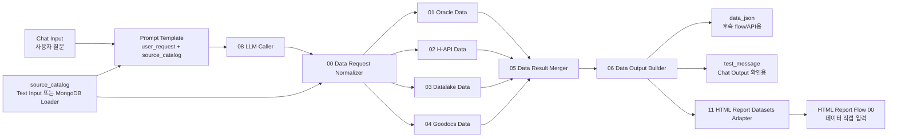
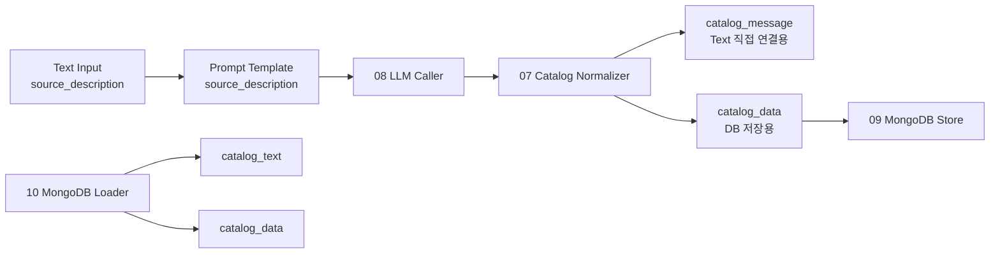

# 재사용 데이터 조회 Flow 구조 분석

이 문서는 `reusable_data_flow`가 어떤 목적으로 만들어졌고, Langflow에서 어떤 순서로 연결되는지 빠르게 파악하기 위한 구조 분석 문서입니다.

## 1. 폴더 구조

```text
reusable_data_flow/
├─ README.md
├─ docs/
│  ├─ REUSABLE_DATA_FLOW_GUIDE.md
│  ├─ REUSABLE_DATA_FLOW_PROMPTS_AND_INPUTS.md
│  └─ FLOW_STRUCTURE_ANALYSIS.md
└─ langflow_components/
   └─ reusable_data_flow_components/
      ├─ 00_data_request_normalizer.py
      ├─ 01_oracle_data.py
      ├─ 02_h_api_data.py
      ├─ 03_datalake_data.py
      ├─ 04_goodocs_data.py
      ├─ 05_data_result_merger.py
      ├─ 06_data_output_builder.py
      ├─ 07_source_catalog_normalizer.py
      ├─ 08_llm_caller.py
      ├─ 09_source_catalog_mongodb_store.py
      ├─ 10_source_catalog_mongodb_loader.py
      └─ 11_html_report_datasets_adapter.py
```

## 2. 전체 개념

이 flow는 크게 두 단계로 나뉩니다.

1. `source_catalog` 작성/관리
   - 사람이 데이터 소스 설명을 적습니다.
   - LLM이 설명을 구조화된 `source_catalog`로 바꿉니다.
   - 필요하면 MongoDB에 source별로 저장하고 다시 불러옵니다.

2. 데이터 조회
   - 사용자의 자연어 질문을 LLM이 짧은 `name + params` 요청으로 바꿉니다.
   - `00 Data Request Normalizer`가 `source_catalog`에서 실행 설정을 채워 실행 가능한 `data_request`를 만듭니다.
   - Oracle/H-API/Datalake/Goodocs 전용 노드가 자신에게 해당하는 요청만 실행합니다.
   - `05 Merger`와 `06 Output Builder`가 결과를 하나의 JSON과 확인용 메시지로 정리합니다.

## 3. 구조도



## 4. Source Catalog 작성 경로



`source_catalog`에는 source별 설명, 키워드, required params, parameter format, query/API/doc 설정이 들어갑니다. LLM은 매번 SQL이나 API URL을 생성하지 않고, source 이름과 params만 고르는 역할로 제한하는 구조입니다.

## 5. 노드별 역할

| 번호 | 노드 | 파일 | 핵심 입력 | 핵심 출력 | 역할 |
| --- | --- | --- | --- | --- | --- |
| 00 | Data Request Normalizer | `00_data_request_normalizer.py` | `LLM Result`, `Data Catalog` | `Data Request` | LLM이 고른 source 이름과 params를 `source_catalog` 기준으로 실행 가능한 요청으로 보정 |
| 01 | Oracle Data | `01_oracle_data.py` | `Data Request`, `Oracle TNS` | `Data Result` | `source_type=oracle` 요청만 골라 SQL 템플릿을 실행 |
| 02 | H-API Data | `02_h_api_data.py` | `Data Request`, `H-API Token` | `Data Result` | `source_type=h_api` 요청만 골라 API body를 구성하고 호출 |
| 03 | Datalake Data | `03_datalake_data.py` | `Data Request`, `LAKE_USER_ID`, `LAKE_JWT_TK` | `Data Result` | Datalake SQL 요청을 실행 |
| 04 | Goodocs Data | `04_goodocs_data.py` | `Data Request`, Goodocs 인증값 | `Data Result` | Goodocs 문서 source를 조회 |
| 05 | Data Result Merger | `05_data_result_merger.py` | 네 종류의 `Data Result` | `Data Result` | source별 결과를 요청 순서 기준으로 병합 |
| 06 | Data Output Builder | `06_data_output_builder.py` | `Data Result` | `Data JSON`, `Test Message` | 후속 flow/API용 JSON과 Chat Output 확인용 표 메시지 생성 |
| 07 | Catalog Normalizer | `07_source_catalog_normalizer.py` | `LLM Result` | `Catalog Text`, `Catalog Data` | LLM이 만든 catalog 후보를 표준 `source_catalog` 형태로 정규화 |
| 08 | LLM Caller | `08_llm_caller.py` | `Prompt` | `LLM Result` | Langflow 기본 Agent 없이 Prompt Template 결과를 LLM에 전달 |
| 09 | Catalog MongoDB Store | `09_source_catalog_mongodb_store.py` | `Catalog Data`, Mongo 설정 | `Catalog Data`, `Store Result` | source별로 MongoDB에 upsert |
| 10 | Catalog MongoDB Loader | `10_source_catalog_mongodb_loader.py` | Mongo 설정 | `Catalog Text`, `Catalog Data` | 저장된 source들을 다시 하나의 `source_catalog`로 조립 |
| 11 | HTML Report Datasets Adapter | `11_html_report_datasets_adapter.py` | `Data JSON` | `HTML Datasets Data`, `HTML Datasets Text` | 06번 출력의 조회 결과 묶음을 HTML 리포트 flow가 읽는 `datasets` JSON으로 변환 |

## 6. 데이터 계약

### LLM이 만드는 최소 요청

```json
{
  "name": "production_summary",
  "params": {
    "DATE": "20260520",
    "FACTORY": "FAB1"
  }
}
```

### 00번이 보강한 실행 요청

```json
{
  "source_type": "oracle",
  "name": "production_summary",
  "params": {
    "DATE": "20260520",
    "FACTORY": "FAB1"
  },
  "required_params": ["DATE", "FACTORY"],
  "param_order": ["DATE", "FACTORY"],
  "param_formats": {
    "DATE": "YYYYMMDD",
    "FACTORY": "text"
  },
  "source_config": {
    "db_key": "PKG_RPT",
    "query_template": "SELECT ..."
  }
}
```

### 06번 최종 출력

`Data Output Builder.data_json`은 후속 flow에서 쓰기 좋은 구조화 JSON입니다.

```json
{
  "success": true,
  "mode": "single",
  "data_result": [
    [
      {"WORK_DT": "20260520", "FACTORY": "FAB1", "PRODUCTION": 100}
    ]
  ],
  "source_results": []
}
```

## 7. 중요한 설계 포인트

- `source_catalog`는 Prompt Template과 `00 Data Request Normalizer`에 모두 연결합니다.
- Prompt Template은 LLM이 어떤 source를 고를지 판단하기 위해 catalog를 사용합니다.
- 00번 Normalizer는 LLM 결과를 믿지 않고 catalog 기준으로 `source_type`, `required_params`, `param_order`, `source_config`를 채웁니다.
- Oracle/H-API/Datalake/Goodocs 노드는 같은 `data_request`를 받지만 자기 `source_type`만 실행합니다.
- 현재 데이터 노드에는 배선 확인용 dummy row 생성 로직이 남아 있습니다. 실제 외부 호출을 하려면 각 파일의 `_run_*` 함수에서 dummy block을 제거하거나 실제 실행 block을 사용해야 합니다.
- 긴 SQL은 Text Input preview나 Freeze text로 재사용하면 잘릴 수 있으므로 `catalog_data` 직접 연결 또는 MongoDB Store/Loader 경로가 안전합니다.

## 8. HTML Report Flow와 연결할 때

이 flow의 `06 Data Output Builder.data_json`은 `11 HTML Report Datasets Adapter`를 거치면 HTML 리포트 flow의 데이터 입력으로 바로 넘기기 좋은 형태가 됩니다.

연결 개념:

```text
Reusable Data Flow
06 Data Output Builder.data_json
-> 11 HTML Report Datasets Adapter.data_json
-> 11 HTML Report Datasets Adapter.html_datasets_text
-> HTML Report Flow
00 리포트 요청/데이터 불러오기.데이터 직접 입력
```

어댑터 출력은 항상 아래처럼 `datasets` 배열입니다. 단일 조회도 dataset 1개짜리로 통일해 뒤 flow 연결을 단순하게 유지합니다.

```json
{
  "datasets": [
    {
      "dataset_id": "production_summary",
      "label": "production_summary (oracle)",
      "rows": [
        {"WORK_DT": "20260520", "FACTORY": "FAB1", "PRODUCTION": 100}
      ]
    }
  ],
  "source": "reusable_data_flow.data_json",
  "success": true,
  "mode": "single"
}
```

여러 source/request 결과가 있으면 `datasets` 안에 조회 단위별 dataset이 여러 개 생깁니다. HTML 리포트 flow는 이 배열을 받아 `joined_auto` 또는 개별 dataset view로 분석할 수 있습니다.
